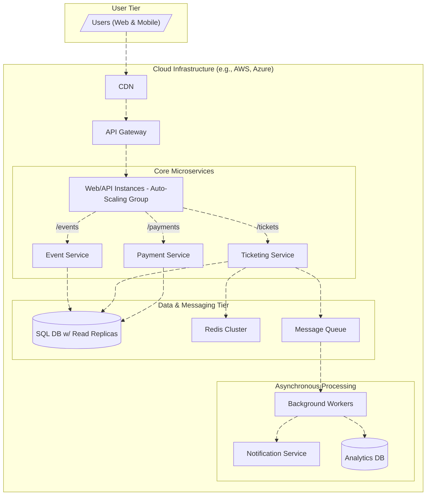

```mermaid
	flowchart TD
		subgraph SubGraph0["User Tier"]
		Users[/"Users (Web & Mobile)"/]

end
subgraph  subGraph1["Core Microservices"]

EventSvc["Event Service"]

ASG["Web/API Instances - Auto-Scaling Group"]

TicketSvc["Ticketing Service"]

PaymentSvc["Payment Service"]

end
subgraph subGraph2["Data & Messaging Tier"]
        DB[("SQL DB w/ Read Replicas")]
        Redis["Redis Cluster"]
        Queue["Message Queue"]
  end
 subgraph subGraph3["Asynchronous Processing"]
        Worker["Background Workers"]
        NotifSvc["Notification Service"]
        AnalyticsDB[("Analytics DB")]
  end
 subgraph subGraph4["Cloud Infrastructure (e.g., AWS, Azure)"]
        APIGW["API Gateway"]
        CDN["CDN"]
        subGraph1
        subGraph2
        subGraph3
  end
    Users L_Users_CDN_0@--> CDN
    CDN L_CDN_APIGW_0@--> APIGW
    APIGW L_APIGW_ASG_0@--> ASG
    ASG L_ASG_EventSvc_0@-- /events --> EventSvc
    ASG L_ASG_TicketSvc_0@-- /tickets --> TicketSvc
    ASG L_ASG_PaymentSvc_0@-- /payments --> PaymentSvc
    EventSvc L_EventSvc_DB_0@--> DB
    TicketSvc L_TicketSvc_Redis_0@--> Redis & DB & Queue
    PaymentSvc L_PaymentSvc_DB_0@--> DB
    Queue L_Queue_Worker_0@--> Worker
    Worker L_Worker_NotifSvc_0@--> NotifSvc & AnalyticsDB


    L_Users_CDN_0@{ animation: fast } 
    L_CDN_APIGW_0@{ animation: fast } 
    L_APIGW_ASG_0@{ animation: fast } 
    L_ASG_EventSvc_0@{ animation: fast } 
    L_ASG_TicketSvc_0@{ animation: fast } 
    L_ASG_PaymentSvc_0@{ animation: fast } 
    L_EventSvc_DB_0@{ animation: fast } 
    L_TicketSvc_Redis_0@{ animation: fast } 
    L_TicketSvc_DB_0@{ animation: fast } 
    L_TicketSvc_Queue_0@{ animation: fast } 
    L_PaymentSvc_DB_0@{ animation: fast } 
    L_Queue_Worker_0@{ animation: fast } 
    L_Worker_NotifSvc_0@{ animation: fast } 
    L_Worker_AnalyticsDB_0@{ animation: fast } 


	


    
```
